# Use cases

## show-stock-price

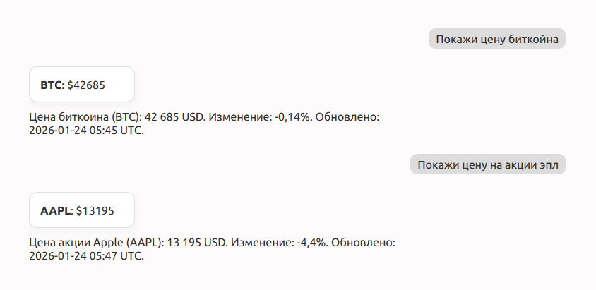

## highlight-section

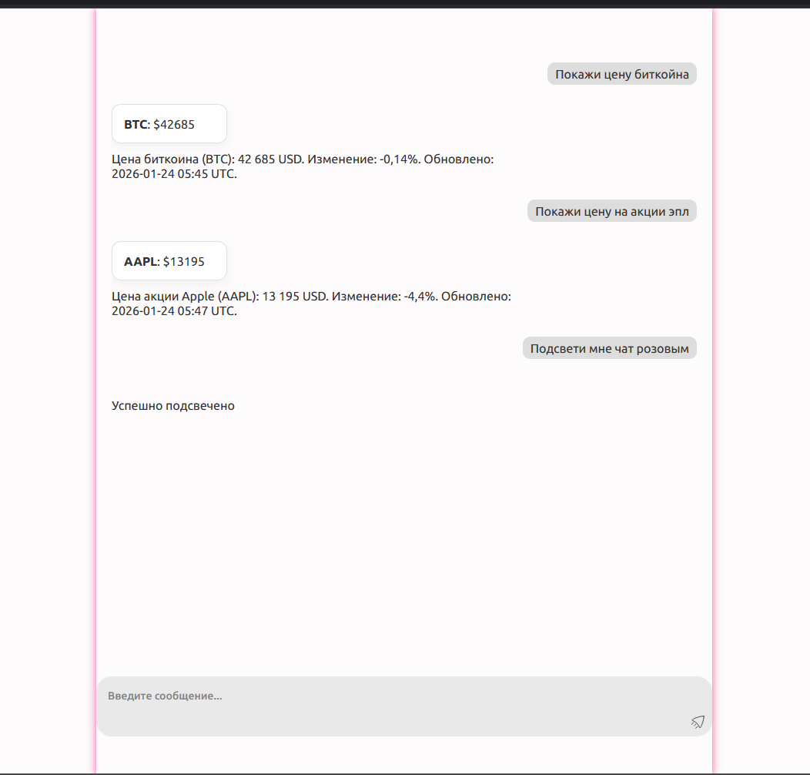
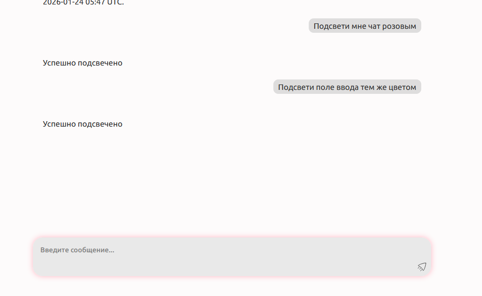
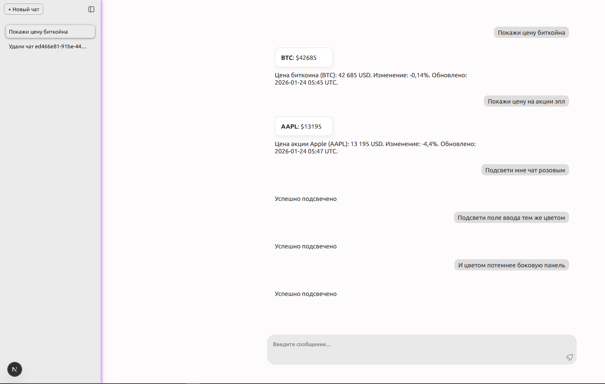

## delete-thread

Чтобы не искать айди чата, можете нажать ПКМ на него в сайдбаер и скопировать айдишник. Не очень хорошо давать айди с бд, но в контексте таски дабы не мудрить, решил оставить так.

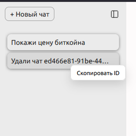
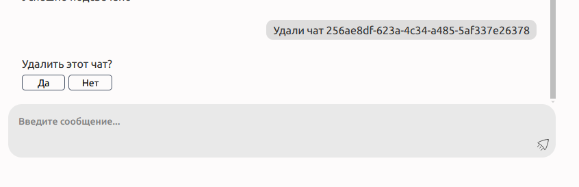

## get-table-range

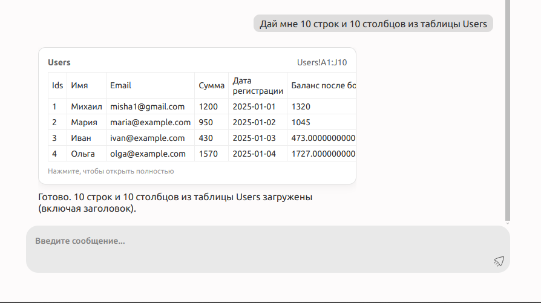

Открыв диалоговое окно с фулл таблицей вы можете выделить диапазон, на пк - ЛКМ, на мобилке - дабл тоуч. Если ваш курсор/палец подойдёт близко к краю, то таблица начнём скролиться и дальше выделять интервал))) UXик)

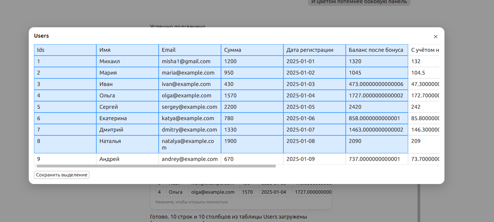

ПКМ (на пк) или зажать (мобилки) на любую ячейку и появится контекстное окно, через которое можно скопировать содержимое ОДНОЙ ячейки.

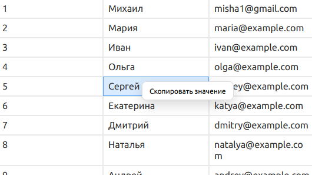

После выделения дипазона ячеек можем вставить соответствующий меншон в инпут чата нажав на кнопку в левом нижнем углу

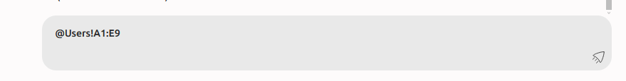

## explain-formula

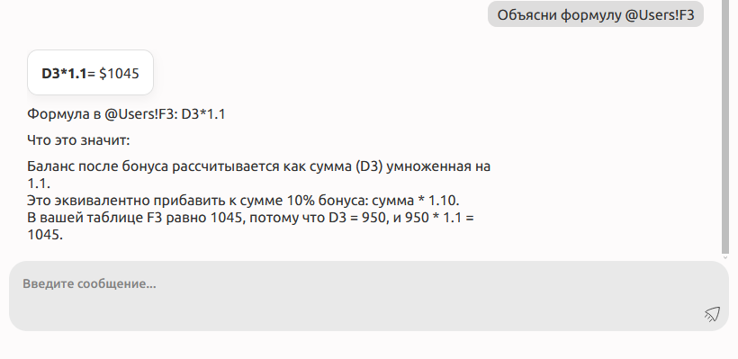

## update-cell

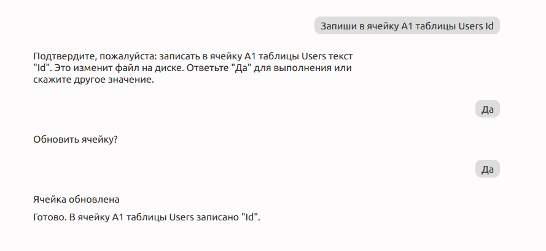
